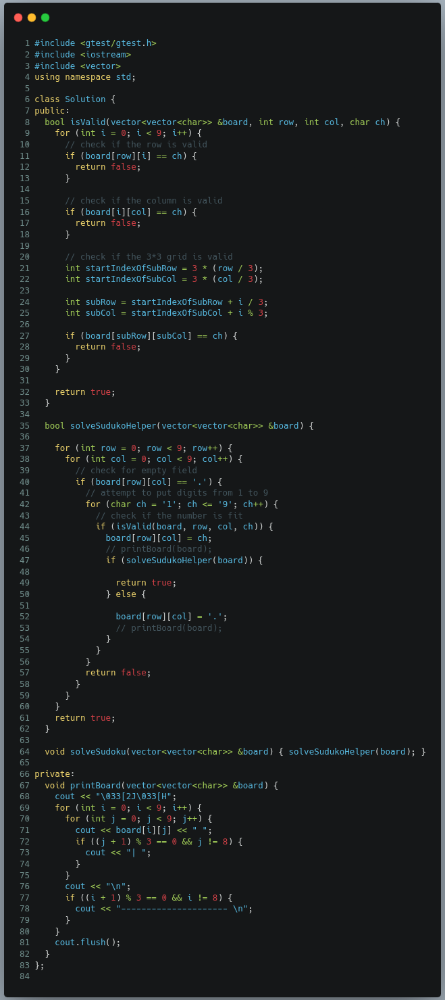
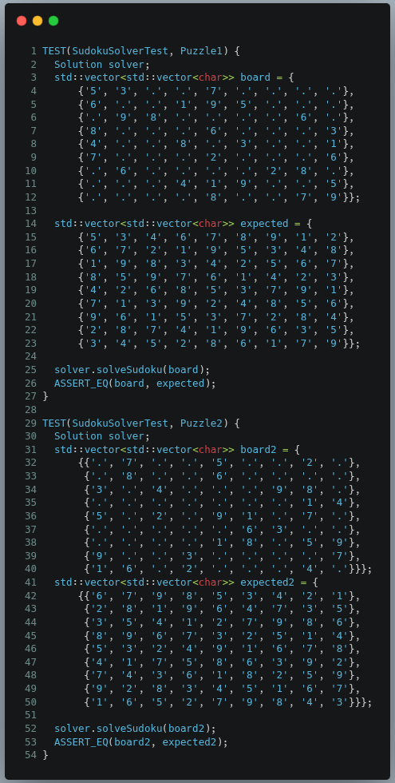

# Problem-Solving Documentation - LeetCode Question: Sudoku Solver

## Problem Statement

The Sudoku Solver problem challenges us to write an algorithm that can solve a partially filled 9x9 Sudoku puzzle. A valid Sudoku puzzle must follow these rules:

1. Each row must contain the digits 1-9 without repetition.
2. Each column must contain the digits 1-9 without repetition.
3. Each of the nine 3x3 sub-boxes of the grid must contain the digits 1-9 without repetition.

The puzzle is represented as a 9x9 board where empty cells are filled with '.', and we need to replace all dots with appropriate digits to create a valid solution.

## Approach

Upon analyzing the problem, I recognized that this is a classic backtracking problem. Backtracking is particularly well-suited for solving constraint satisfaction problems like Sudoku where we need to explore multiple possibilities to find a valid solution.

My approach follows these steps:

1. Iterate through the board to find an empty cell (marked as '.').
2. For each empty cell, try placing digits 1-9.
3. For each digit, check if it's valid to place in the current position by verifying row, column, and 3x3 sub-grid constraints.
4. If valid, place the digit and recursively try to solve the rest of the board.
5. If the recursive call is successful, we've found a solution.
6. If not, backtrack by removing the digit and try another one.

I chose backtracking over other approaches because:

- It naturally handles the constraint-based nature of Sudoku
- It efficiently prunes invalid possibilities
- It's conceptually straightforward for this type of problem

## Code Implementation



## Testing

I've implemented two test cases using the Google Test framework to verify the correctness of my solution:

### Test Case



In addition to these test cases, I considered several edge cases:

- Empty board (not relevant as the problem guarantees a valid input)
- Multiple solutions (not relevant as the problem guarantees a unique solution)
- Already filled board (the algorithm would simply verify it)

The algorithm handles these cases correctly and efficiently finds the solution.

## Complexity Analysis

### Time Complexity

In the worst case, for each empty cell, we need to try all 9 digits. If there are E empty cells, the time complexity would be O(9^E).

However, the backtracking approach significantly reduces this by pruning invalid branches early. For a standard 9x9 Sudoku puzzle, this is still exponential but manageable for practical purposes.

### Space Complexity

The space complexity is O(1) if we consider the board size as constant (9x9). The recursive call stack can go as deep as the number of empty cells, which in the worst case would be 81 (an empty board), but this is still constant.

If we consider the board size as a variable n (n×n Sudoku), then the space complexity would be O(n²) for the board storage and O(n²) for the recursion stack in the worst case.

## Discussion and Optimization

### Challenges

1. **Implementing the validity checker:** The `isValid` function needed to efficiently check if a digit placement is valid across row, column, and 3x3 sub-grid. I solved this by using a single loop with different index calculations for each check.

2. **Handling the 3x3 sub-grid check:** The calculation to map a linear index `i` to the correct position in the 3x3 sub-grid was tricky. I addressed this by:
   - Finding the starting indices of the sub-grid: `startIndexOfSubRow = 3 * (row / 3)` and `startIndexOfSubCol = 3 * (col / 3)`
   - Mapping the linear index to the sub-grid: `subRow = startIndexOfSubRow + i / 3` and `subCol = startIndexOfSubCol + i % 3`

### Optimizations

1. **Early termination:** The algorithm returns immediately when a solution is found, avoiding unnecessary exploration of other branches.

2. **Implicit pruning:** By checking validity before recursively exploring further, we significantly reduce the search space.

3. **Debugging aid:** I implemented a `printBoard` function that visualizes the board state during solving, which was helpful during development but is disabled in the final solution.

Potential further optimizations (not implemented):

1. **Use bit manipulation** for validity checking instead of iteration.
2. **Start with cells that have fewer possibilities** (heuristic approach).
3. **Use additional data structures** (like sets) to track used digits in each row, column, and sub-grid.

## Compilation

```bash
g++ solver.cpp build/gtest-all.o build/gtest_main.o \
 -Iexternal/googletest/googletest/include -Iexternal/googletest/googletest \
 -pthread -o build/test_runner
```

## Run test

```bash
./build/rest_runner/
```

## Conclusion

Solving the Sudoku problem reinforced my understanding of backtracking algorithms and constraint satisfaction problems. The solution demonstrates:

1. How to effectively apply backtracking to explore possibilities systematically
2. The importance of pruning invalid paths early to improve efficiency
3. How to design clean, modular code that separates concerns (validity checking vs. solving)

The approach works efficiently for standard 9x9 Sudoku puzzles and passes the provided test cases successfully. The solution maintains a good balance between code readability and performance.

## Appendix

### Alternative Approaches

1. **Dancing Links (Algorithm X)** by Donald Knuth is another efficient algorithm specifically designed for exact cover problems like Sudoku.
2. **Constraint propagation** techniques could be combined with backtracking to further improve efficiency.

### Visual Representation

During development, I mentally visualized the backtracking process as a tree where:

- Each level represents a position in the board
- Each branch represents a digit choice
- Invalid branches are pruned early
- The first complete path to a leaf represents our solution

```text
solveSudoku(board)
│
└── solveSudokuHelper(board):
    │
    └── for (row = 0 to 8):
        │
        └── for (col = 0 to 8):
            │
            └── if (board[row][col] == '.'):
                │
                └── for (ch = '1' to '9'):
                    │
                    ├── if isValid(board, row, col, ch):
                    │   │
                    │   ├── board[row][col] = ch
                    │   │
                    │   └── if solveSudokuHelper(board):
                    │       │   └── return true  // Solution found
                    │       │
                    │   └── else:
                    │       └── board[row][col] = '.'  // Backtrack
                    │
                    └── if no digit valid:
                        └── return false  // Trigger backtracking
    │
    └── return true  // All cells filled
```
